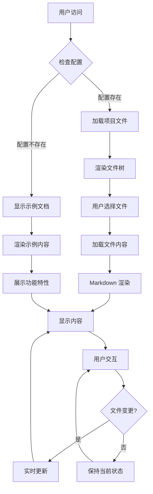
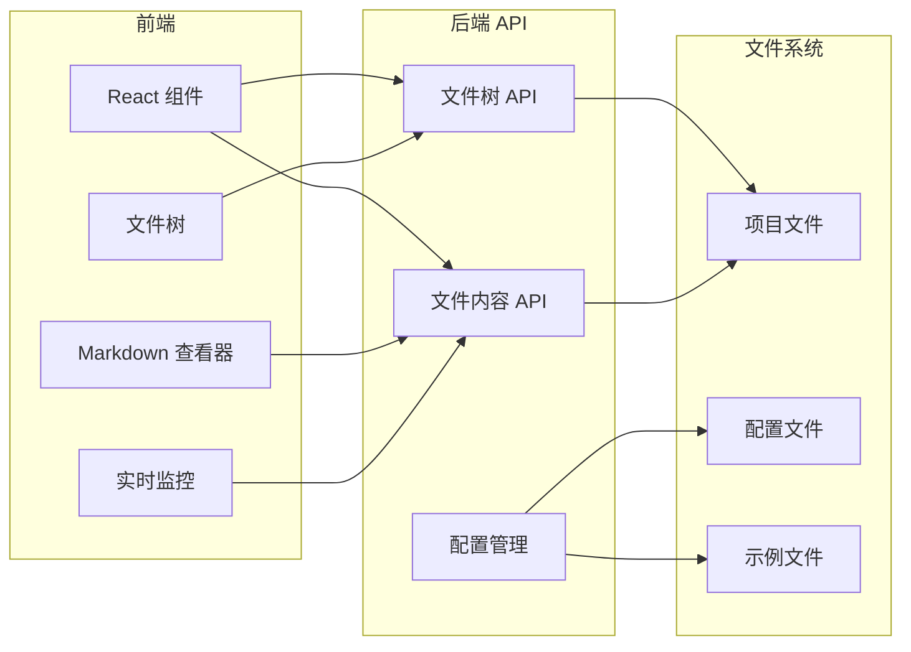
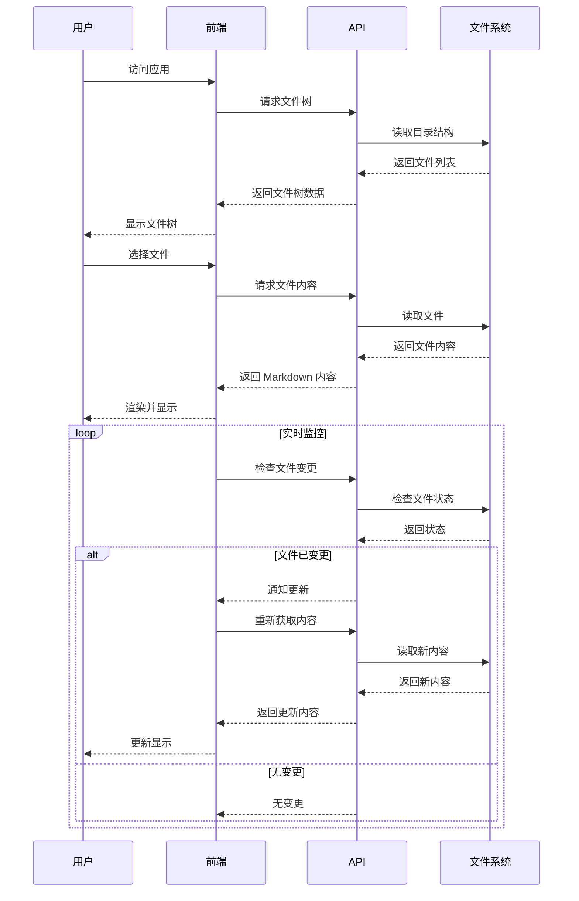
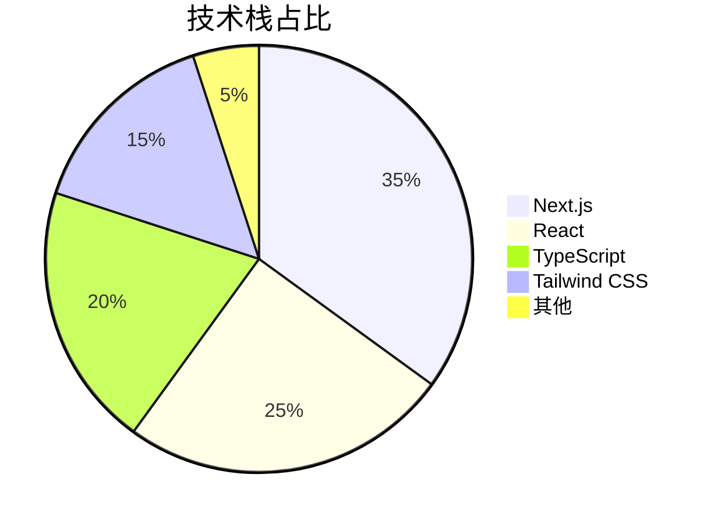

# MarkdownView 功能展示

欢迎使用 MarkdownView！这是一个功能演示文档，展示了所有支持的 Markdown 特性。

## 📋 目录

- [基本语法](#基本语法)
- [代码高亮](#代码高亮)
- [表格](#表格)
- [任务列表](#任务列表)
- [图表展示](#图表展示)
- [数学公式](#数学公式)
- [引用和提示](#引用和提示)
- [链接和图片](#链接和图片)

---

## 基本语法

### 标题层级

# 一级标题
## 二级标题
### 三级标题
#### 四级标题
##### 五级标题
###### 六级标题

### 文本样式

**粗体文本** 和 *斜体文本* 以及 ***粗斜体文本***

~~删除线文本~~

普通文本和 `行内代码`

> 这是一个引用块
> 
> 可以包含多行内容

### 列表

#### 无序列表
- 项目 1
- 项目 2
  - 子项目 2.1
  - 子项目 2.2
- 项目 3

#### 有序列表
1. 第一项
2. 第二项
   1. 子项目 2.1
   2. 子项目 2.2
3. 第三项

---

## 代码高亮

### JavaScript 代码
```javascript
// React 组件示例
import React, { useState, useEffect } from 'react';

const MarkdownViewer = ({ content }) => {
  const [isLoading, setIsLoading] = useState(true);
  
  useEffect(() => {
    // 模拟加载过程
    const timer = setTimeout(() => {
      setIsLoading(false);
    }, 1000);
    
    return () => clearTimeout(timer);
  }, []);

  if (isLoading) {
    return <div className="loading">加载中...</div>;
  }

  return (
    <div className="markdown-content">
      {content}
    </div>
  );
};

export default MarkdownViewer;
```

### Python 代码
```python
# Python 数据处理示例
import pandas as pd
import numpy as np
from datetime import datetime

def process_markdown_files(directory):
    """
    处理指定目录下的 Markdown 文件
    """
    files = []
    
    for root, dirs, filenames in os.walk(directory):
        for filename in filenames:
            if filename.endswith('.md'):
                file_path = os.path.join(root, filename)
                file_stats = {
                    'name': filename,
                    'path': file_path,
                    'size': os.path.getsize(file_path),
                    'modified': datetime.fromtimestamp(
                        os.path.getmtime(file_path)
                    )
                }
                files.append(file_stats)
    
    return pd.DataFrame(files)

# 使用示例
df = process_markdown_files('./project-wiki')
print(f"找到 {len(df)} 个 Markdown 文件")
```

### SQL 查询
```sql
-- 数据库查询示例
SELECT 
    f.filename,
    f.file_size,
    f.created_at,
    COUNT(v.id) as view_count,
    AVG(v.reading_time) as avg_reading_time
FROM files f
LEFT JOIN views v ON f.id = v.file_id
WHERE f.file_type = 'markdown'
    AND f.created_at >= DATE_SUB(NOW(), INTERVAL 30 DAY)
GROUP BY f.id, f.filename, f.file_size, f.created_at
ORDER BY view_count DESC, f.created_at DESC
LIMIT 10;
```

### Shell 脚本
```bash
#!/bin/bash
# 自动部署脚本

set -e

echo "🚀 开始部署 MarkdownView..."

# 检查 Node.js 版本
node_version=$(node --version)
echo "Node.js 版本: $node_version"

# 安装依赖
echo "📦 安装依赖..."
npm ci

# 构建项目
echo "🔨 构建项目..."
npm run build

# 启动服务
echo "🌟 启动服务..."
npm start

echo "✅ 部署完成！"
```

---

## 表格

### 基本表格

| 功能 | 状态 | 描述 |
|------|------|------|
| 文件树导航 | ✅ 完成 | 左侧面板显示文件结构 |
| Markdown 渲染 | ✅ 完成 | 支持 GitHub Flavored Markdown |
| 代码高亮 | ✅ 完成 | 使用 Prism.js 语法高亮 |
| 实时监控 | ✅ 完成 | 文件变更自动刷新 |
| 位置记忆 | ✅ 完成 | 自动保存浏览位置 |
| 响应式设计 | ✅ 完成 | 支持桌面和移动端 |

### 性能数据表格

| 指标 | 开发环境 | 生产环境 | 目标值 |
|------|----------|----------|--------|
| 首次加载时间 | 1.2s | 0.8s | < 1s |
| 文件解析时间 | 50ms | 30ms | < 100ms |
| 内存使用 | 45MB | 35MB | < 50MB |
| 包大小 | 2.1MB | 1.8MB | < 2MB |

---

## 任务列表

### 项目进度
- [x] 项目初始化
- [x] 基础组件开发
- [x] 文件树功能
- [x] Markdown 渲染
- [x] 代码高亮
- [x] 实时监控
- [x] 位置记忆
- [x] 响应式设计
- [x] 配置系统
- [ ] 搜索功能
- [ ] 主题切换
- [ ] 导出功能

### 待办事项
- [ ] 添加全文搜索
- [ ] 支持多主题切换
- [ ] 添加 PDF 导出
- [ ] 支持图片上传
- [ ] 添加评论系统
- [ ] 支持多语言

---

## 图表展示

### 流程图


### 系统架构图


### 时序图


### 饼图


---

## 数学公式

### 行内公式
这是一个行内公式：$E = mc^2$，爱因斯坦的质能方程。

### 块级公式

#### 二次方程求根公式
$$x = \frac{-b \pm \sqrt{b^2 - 4ac}}{2a}$$

#### 积分公式
$$\int_{a}^{b} f(x) dx = F(b) - F(a)$$

#### 矩阵
$$\begin{pmatrix}
a & b \\
c & d
\end{pmatrix}
\begin{pmatrix}
x \\
y
\end{pmatrix}
=
\begin{pmatrix}
ax + by \\
cx + dy
\end{pmatrix}$$

#### 求和公式
$$\sum_{i=1}^{n} i = \frac{n(n+1)}{2}$$

---

## 引用和提示

### 多级引用
> 这是一级引用
> 
> > 这是二级引用
> > 
> > > 这是三级引用

### 代码引用
> 如 Linus Torvalds 所说：
> 
> ```
> Talk is cheap. Show me the code.
> ```

### 重要提示

> **💡 提示**  
> 这是一个重要的提示信息，帮助用户更好地理解功能。

> **⚠️ 注意**  
> 请确保您的 Node.js 版本 >= 18.0.0 以获得最佳性能。

> **✅ 成功**  
> 配置已成功加载，应用正在正常运行。

> **❌ 错误**  
> 无法找到指定的项目目录，请检查配置。

---

## 链接和图片

### 链接类型

- [内部链接](#基本语法)
- [外部链接](https://github.com)
- [带标题的链接](https://nextjs.org "Next.js 官网")
- <https://example.com> (自动链接)

### 图片展示


*图片说明：MarkdownView 应用界面预览*

---

## 高级功能

### HTML 标签支持

<details>
<summary>点击展开详细信息</summary>

这里是折叠内容，包含了更多的详细信息。

- 支持 HTML 标签
- 可以创建交互式内容
- 提供更好的用户体验

</details>

### 键盘快捷键

| 快捷键 | 功能 |
|--------|------|
| <kbd>Ctrl</kbd> + <kbd>F</kbd> | 搜索 |
| <kbd>Ctrl</kbd> + <kbd>R</kbd> | 刷新 |
| <kbd>F11</kbd> | 全屏 |
| <kbd>Esc</kbd> | 退出全屏 |

### 脚注支持

这里有一个脚注引用[^1]，还有另一个脚注[^note]。

[^1]: 这是第一个脚注的内容。
[^note]: 这是一个命名脚注的内容。

---

## 结语

🎉 **恭喜！** 您已经看完了 MarkdownView 的所有功能展示。

这个应用支持：
- ✅ 完整的 Markdown 语法
- ✅ 代码语法高亮
- ✅ Mermaid 图表渲染
- ✅ 数学公式显示
- ✅ 响应式设计
- ✅ 实时文件监控
- ✅ 位置记忆功能

如果您有自己的 Markdown 项目，请通过环境变量或配置文件设置 `MARKDOWN_PROJECT_ROOT` 来指向您的项目目录。

**开始使用：**
```bash
export MARKDOWN_PROJECT_ROOT=/path/to/your/project
./start.sh
```

更多配置选项请参考 [CONFIGURATION.md](./CONFIGURATION.md) 文件。

---

*最后更新：2024年* 