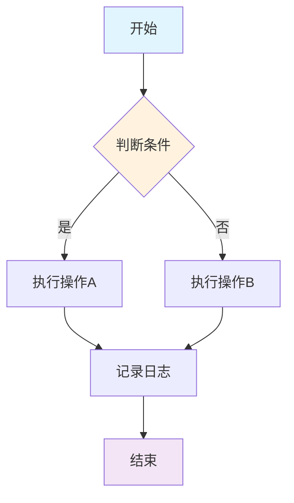
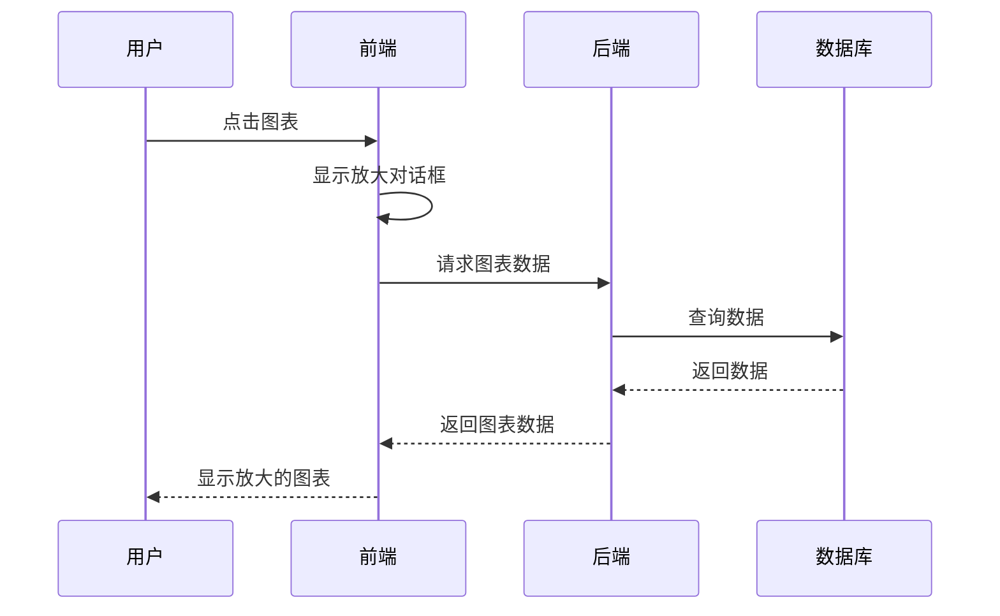
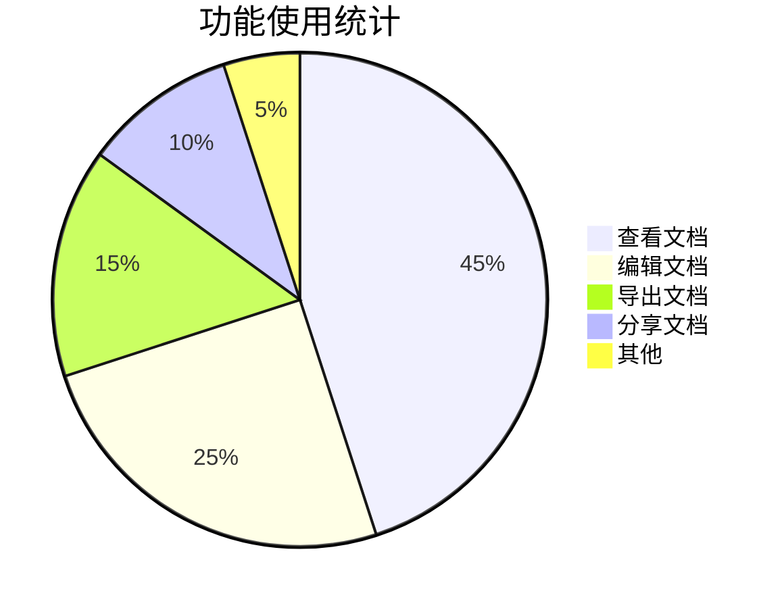
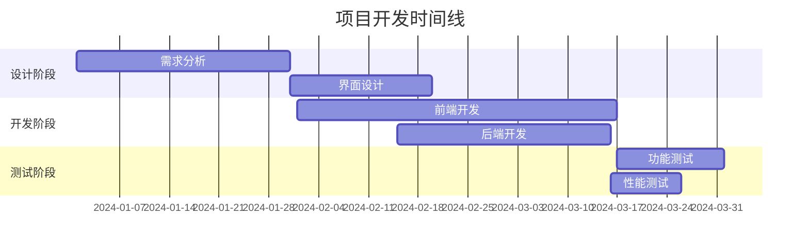
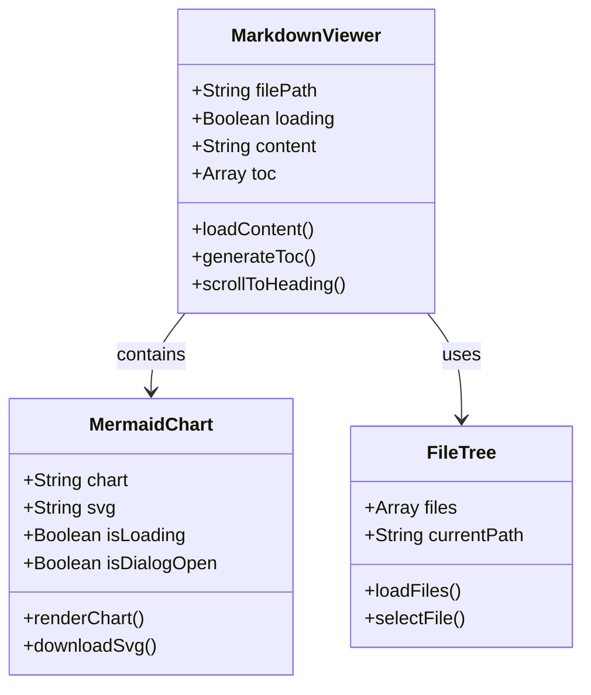

# Mermaid 图表点击放大测试

这个文档用于测试 Mermaid 图表的点击放大功能。

## 流程图测试

点击下面的流程图可以放大查看：

## 时序图测试

点击下面的时序图可以放大查看：

## 饼图测试

点击下面的饼图可以放大查看：

## 甘特图测试

点击下面的甘特图可以放大查看：

## 类图测试

点击下面的类图可以放大查看：

## 测试说明

每个图表都应该具备以下功能：

1. **点击图表本身** - 打开放大对话框
2. **点击放大按钮** - 打开放大对话框  
3. **点击下载按钮** - 下载 SVG 格式的图表
4. **在对话框中下载** - 在放大对话框中也可以下载

### 预期行为

- 图表应该有悬停效果
- 点击图表任意位置都能打开对话框
- 对话框应该居中显示
- 对话框中的图表应该保持清晰度
- 下载的 SVG 文件应该包含完整的图表内容 